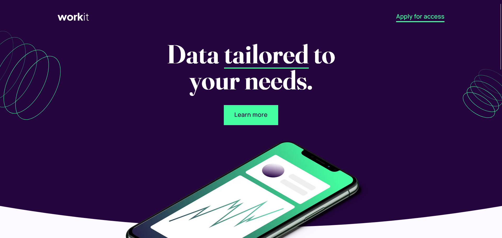

# Frontend Mentor - Workit landing page solution

This is a solution to the [Workit landing page challenge on Frontend Mentor](https://www.frontendmentor.io/challenges/workit-landing-page-2fYnyle5lu). Frontend Mentor challenges help you improve your coding skills by building realistic projects. 

## Table of contents

  - [Screenshot](#screenshot)
  - [Links](#links)
  - [Built with](#built-with)
  - [Author](#author)

### Screenshot

### Links

- Solution URL: []
- Live Site URL: []

### Built with

- SCSS
- Flexbox
- Mobile-first workflow

### Author

Daniel Sisovic